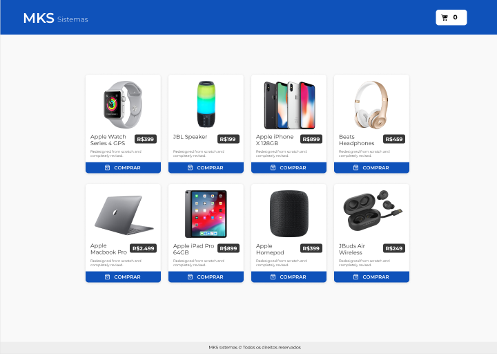

#TESTE_MKS

<p align="center">
  
</p>

## 💻 Projeto

Teste para empresa MKS_Sistemas. O desafio pode ser encontrado através <a href="https://github.com/MKS-desenvolvimento-de-sistemas/mks-frontend-challenge/tree/main">deste GitHub</a>

## ✨ Tecnologias

- [NextJS](https://nextjs.org/)
- [TypeScript](https://www.typescriptlang.org/)
- [Jest](https://jestjs.io/pt-BR/)
- [Tailwind CSS](https://tailwindcss.com/)

## 🚀 Como executar

Clone o projeto e acesse a pasta do mesmo.

```bash
$ git clone https://github.com/ViniciusBussolo1/teste_MKS.git
$ cd teste_MKS
```

Para iniciá-lo, siga os passos abaixo:

```bash
# Instalar as dependências
$ npm install
# Iniciar o projeto
$ npm run dev
```

O app estará disponível no seu browser pelo endereço  http://localhost:3000/.